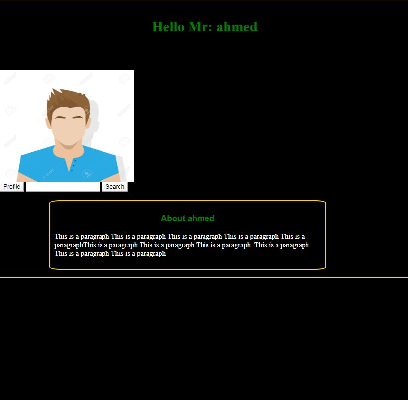
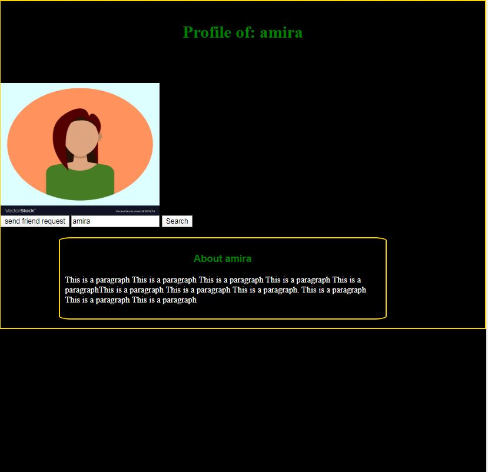
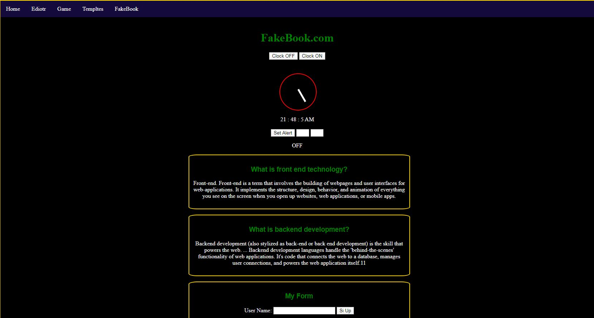

# FakeBook
This is a single page javascript web application,  act like facebook, if you use it you will feel 
there is backend make that happened and there is many html pages not only single page

*  there are three users = ["ahmed", "amira", "mohamed"] , 
*  usernames = ahmed  or amira , mohamed
*  Password = 123 (for any user)
*  you can search for other users and see their profile, and more send friend request (you will go in js journey) 

# (better steps to see the full app)

1.  use this order log with ahmed.
2.  then search for amira add amira.
3. then search for mohamed . else it work too but this is the best order 

 
 
 

 
